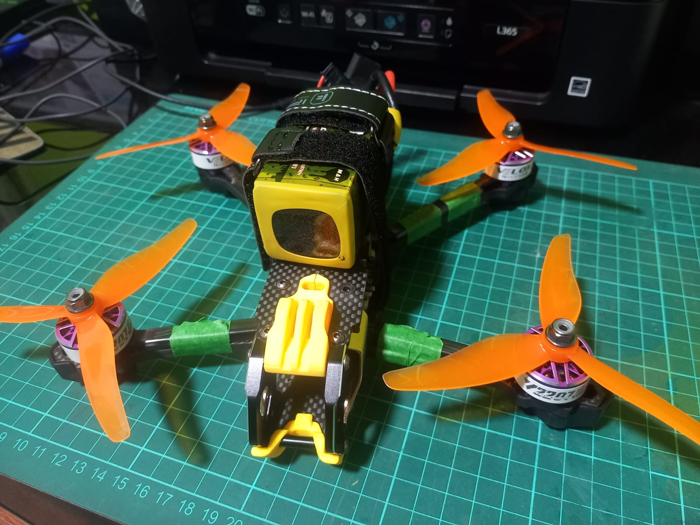
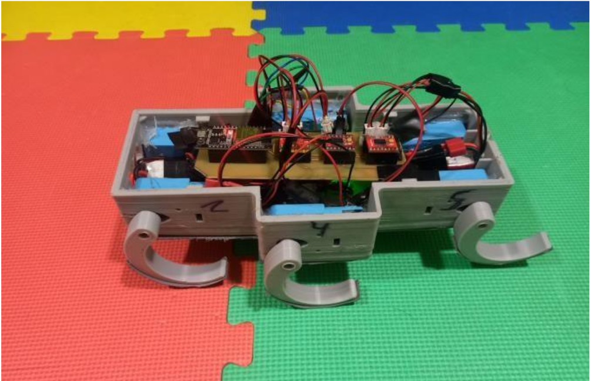

# Hello!, I'm Miguel, a Mechatronics Engeenering Student 🤖 🦾:
- 🎓 **Last year undergraduate student at UNI**  
- 🤖 Expertise in **Robotics, Artificial Intelligence, Internet of Things (IoT), and Industrial Networks**  
- 🏛️ **Active member** of the *Advanced Center for Intelligent Mechatronics (CAMI)*  
  - Project development  
  - Scientific research  
  - Participation in technology fairs  
- 🚀 **Self-learner**, passionate about **emerging technologies and innovation**, creative thinker  
- 🌍 **Languages:**  
  - 🇪🇸 Native Spanish  
  - 🇬🇧 Advanced English  

# 💻 Tech Stack:
                         

# PROJECTS
| Columna 1 | Columna 2 |
|---|---|
|  |  |
